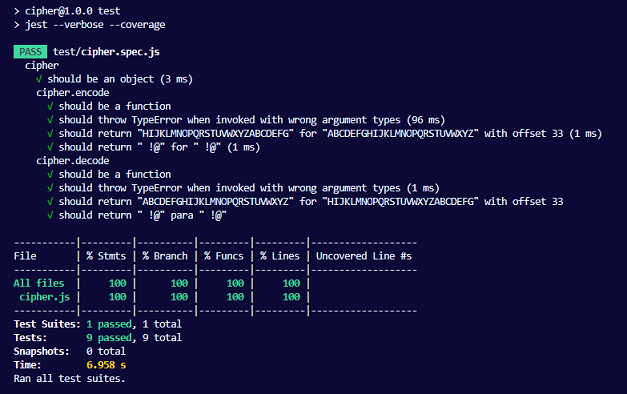

# Correio do amor / Cifra de César 

## Índice

* [1. Prefácio](#1-prefácio)
* [2. Resumo do projeto](#2-resumo-do-projeto)
* [3. Protótipo](#3-protótipo)
* [4. Usabilidade](#4-usabilidade)
* [5. Experiência](#5-experiência)
* [6. Tecnologias utilizadas](#6-tecnologias-utilizadas)
* [7. Interface](#7-interface)
* [8. Teste](#8-teste)
* [9. Para considerar o feedback do projeto](#9-para-considerar-o-feedback-do-projeto)
* [10.Desenvolvedora](#10-desenvolvedora)
***

## 1. Prefácio

Encriptar significa ocultar o conteúdo de uma mensagem a olho nu,
para que somente as partes autorizadas possam decifrar um texto cifrado.
A [cifra de César](https://pt.wikipedia.org/wiki/Cifra_de_C%C3%A9sar)
é um dos primeiros tipos de criptografias conhecidas na história.
O imperador romano Júlio César utilizava essa cifra para enviar
ordens secretas aos seus generais no campo de batalha.

A cifra de César é uma das técnicas mais simples de cifrar uma mensagem. É um
tipo de cifra por substituição, em que cada letra do texto original é
substituida por outra que se encontra há um número fixo de posições
(deslocamento) mais a frente do mesmo alfabeto.

Por exemplo se usarmos o deslocamento (_offset_) de 3 posições:

* Alfabeto sem cifrar: A B C D E F G H I J K L M N O P Q R S T U V W X Y Z
* Alfabeto com cifra:  D E F G H I J K L M N O P Q R S T U V W X Y Z A B C
* A letra A será D
* A palavra CASA será FDVD

## 2. Resumo do projeto

Este é meu primeiro projeto como desenvolvedora web fornt-end parte do bootcamp do Laboratória.
Neste projeto o usuário irá encontrar um Correio do Amor secreto, onde poderá cifrar e decifrar um texto no navegador indicando um deslocamento
específico de caracteres (_offset_) para escrever mensagens secretas de amor.

## 3. Protótipo

## 4. Usabilidade

**O Usuário será capaz de:**

* **Criptografar uma mensagem**
  - Inserir a mensagem (texto) que deseja criptografar. A mensagem usa um
    alfabeto simplificado (apenas letras maiúsculas).
  - Escolher um número de deslocamento (_offset_) indicando quantas posições
    ele deseja que a cifra desloque cada caractere do alfabeto.
  - Ver o resultado da mensagem criptografada.

* **Descriptografar uma mensagem**
  - Inserir a mensagem (texto) que deseja descriptografar. A mensagem usa um
    alfabeto simplificado (apenas letras maiúsculas).
  - Escolher um número de deslocamento (_offset_, que corresponde ao que usamos
    para criptografar) indicando quantas posições ele deseja que a cifra
    desloque cada caractere do alfabeto.
  - Veja o resultado da mensagem descriptografada.

## 5. Experiência

O Correio do amor tem como usuário foco aquelas pessoas que desejam escrever uma mensagem de amor de maneira secreta, para que só ela e o seu destinatário saibam o conteúdo da mesma.
Se destina a toda e qualquer pessoa que queira codificar uma mensagem para alguém.
Com uma usabilidade simples, o usuário será capaz de escrever sua mensagem e a visualizar em seguida sua mensagem codificada, após isso, terá um botão apenas para traduzir esta mensagem também.

## 6. Tecnologias utilizadas

## 7. Interface

## 8. Teste
Projeto com 100% de aprovação no npm test.

## 9. Link

Clique [aqui](https://rafaelamiliano.github.io/SAP011-cipher/) para visitar a página.

## 10. Desenvolvedora

Github clique [aqui](https://github.com/RafaelaMiliano).

Linkedin clique [aqui](https://www.linkedin.com/in/rafaela-miliano-4b4581223/).

